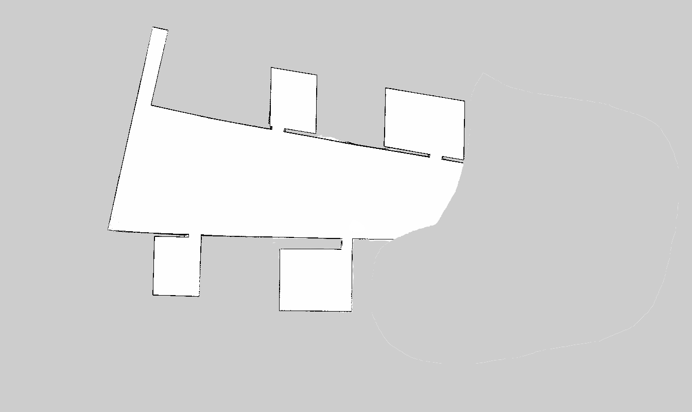
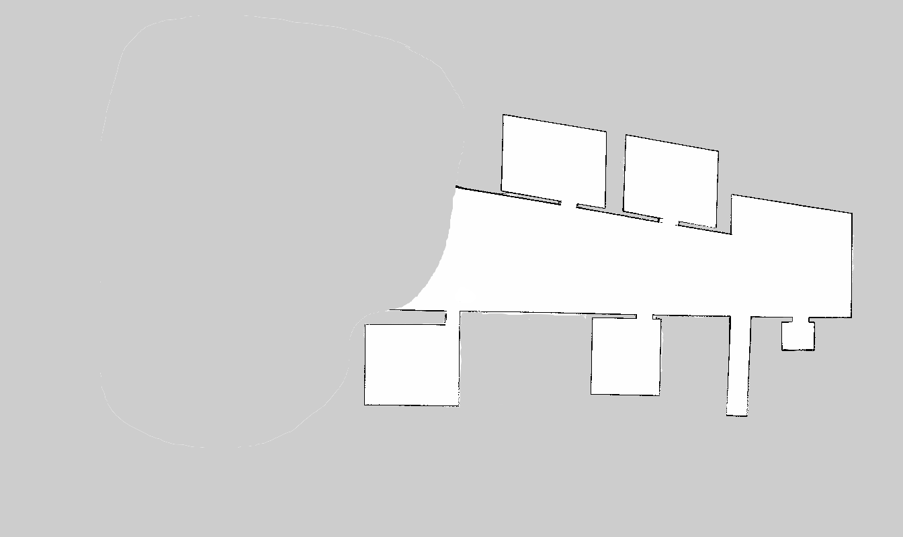
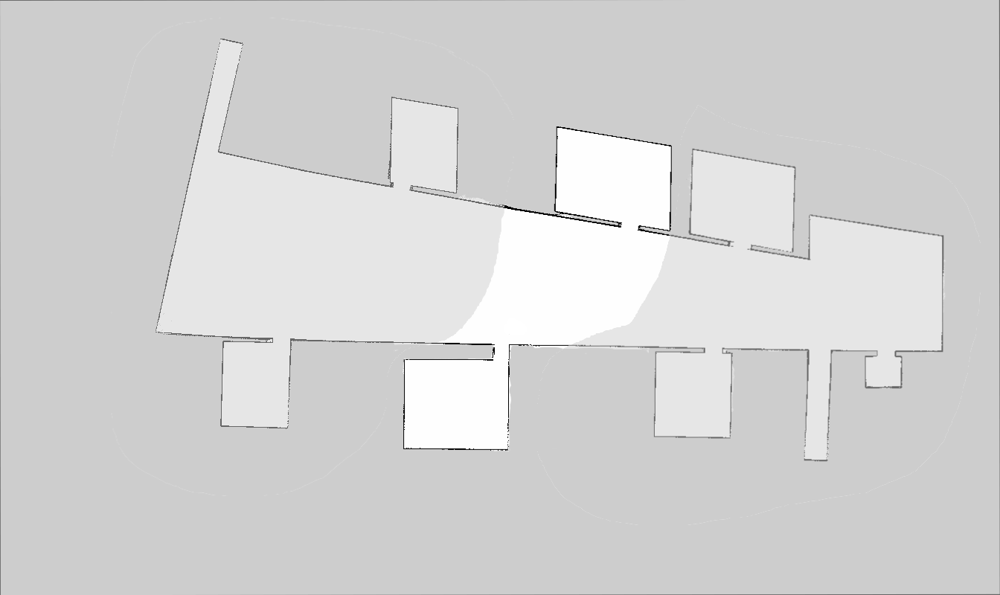
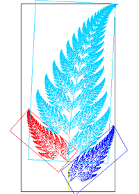

## **Map Merge Tool**

A command line tool to align the image of a map to a previously saved map. The implementation is based on opencvs estimateRigidTransform function, ORB feature extraction and matching the distance of pairwise feature candidates. Meant for images generated via ROS map_server.

Aligns multiple scan maps and combines into a single image. Images given on the command line will be aligned to the first supplied image and their respective rotation/translation and transformation matrix will be returned.

#### **Input:**

 

#### **Output:**

 

#### **What is estimateRigidTransform?**
Computes an optimal affine transformation between two 2D point sets.

#### **What is affine transformation?**
An affine transformation, affine map or an affinity is a function between affine spaces which preserves points, straight lines and planes.

**Example:**

An image of a fern-like fractal that exhibits affine self-similarity. Each of the leaves of the fern is related to each other leaf by an affine transformation. For instance, the red leaf can be transformed into both the small dark blue leaf and the large light blue leaf by a combination of reflection, rotation, scaling, and translation.

#### **What is ORB feature detection and extraction?**
ORBFeatureDetector is a wrapping class for feature detection using the ORB class.
OrbDescriptorExtractor is a wrapping class for computing descriptors by using the ORB class.

ORB is comparatively scale and rotation invariant while still employing the very efficient Hamming distance metric for matching.

Also used BFMatcher to match keypoint descriptors. BFMatcher is going to try all the possibilities (which is the meaning of "Brute Force") and hence it will find the best matches.

#### Instructions to Run:
	g++ -c mapmerge.cpp
	g++ main.cpp mapmerge.o `pkg-config opencv --cflags --libs`
	./a.out input1.pgm input2.pgm output.pgm